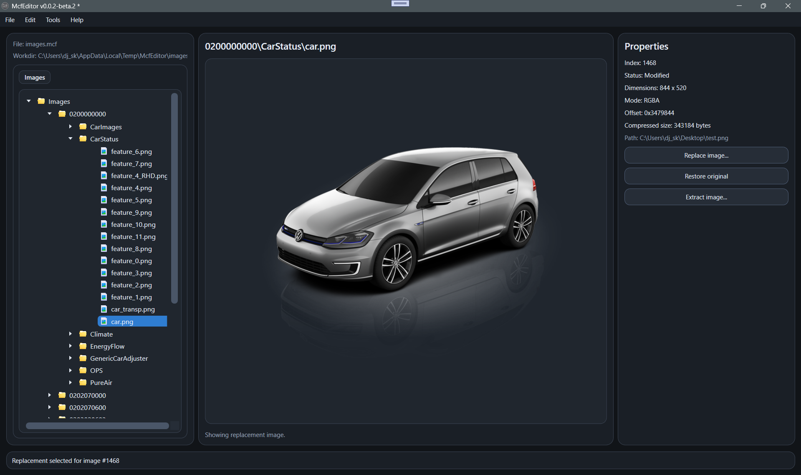

# McfEditor

McfEditor is a Windows tool for extracting, inspecting, modifying and rebuilding MCF image archives used in Volkswagen MIB systems.

The application provides a modern WPF interface and a fully native C# backend.

---

## Screenshot

---

## Features

- Open and extract MCF archives
- Preview images with metadata (dimensions, format, offset, size)
- Browse images using a hierarchical tree view
- Support for imageidmap.res (structured paths)
- Replace images directly from the UI
- Restore original images
- Undo / Redo support
- Rebuild modified MCF archives
- Real-time progress reporting
- No external dependencies (no Python)

---

## Usage

1. Open an MCF file from the File menu  
2. Browse images using the tree view  
3. Select an image to preview it  
4. Replace or restore images  
5. Rebuild the archive when finished  

---

## ImageIdMap support

If an `imageidmap.res` file is present next to the MCF file, McfEditor will:

- Reconstruct the original folder structure  
- Display meaningful paths instead of raw indices  

---

## Output structure

After extraction, files are organized as follows:

WorkingFolder/
├── Unsorted/
│ ├── img_0.png
│ ├── img_1.png
│ └── ...
└── Images/ (if imageidmap is used)
└── structured paths...

---

## Supported formats

- Grayscale (L)  
- RGBA  

Some MCF variants may contain unsupported formats.

---

## Requirements

- Windows 10 / 11  
- .NET Desktop Runtime  

---

## Notes

- Always keep a backup of original files  
- Rebuild operations overwrite output files  

---

## Development

- C#  
- WPF (.NET)  
- Native binary parsing  

---

## License

This project is provided for educational and research purposes.

---

## Repository

https://github.com/djskual/McfEditor
